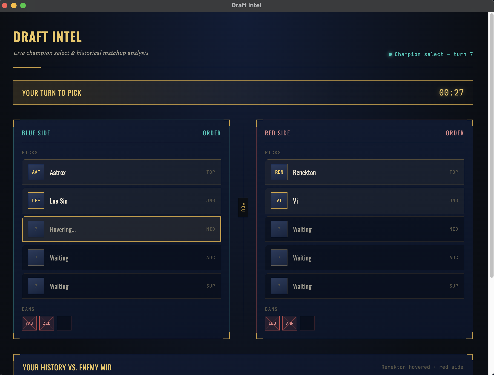

# LoLens

A real-time League of Legends draft companion. LoLens watches your live 
champion select and surfaces your own match history against whoever's 
being picked or banned — so you're seeing your actual win rate against 
that Renekton, not generic tier-list advice.



## Status

Early build. Champion select UI is running in an Electron shell with mock 
data. Live LCU integration and Riot API match history are in progress.

## How it works

- **Electron** shell for the desktop app and UI
- **League Client API (LCU)** — local, unofficial — for live champion 
  select state
- **Riot Web API** — for historical match data and player statistics

## Running it locally

\```
npm install
npm start
\```

## Roadmap

- [ ] Connect to live LCU champion select session
- [ ] Pull real match history via Riot API
- [ ] Show matchup-specific win rate / gold diff stats
- [ ] Packaged .app build

## Legal

LoLens is not endorsed by Riot Games and does not reflect the views or 
opinions of Riot Games or anyone officially involved in producing or 
managing League of Legends. League of Legends and Riot Games are 
trademarks or registered trademarks of Riot Games, Inc.

The League Client API used here is unofficial and not supported by Riot 
for third-party use.