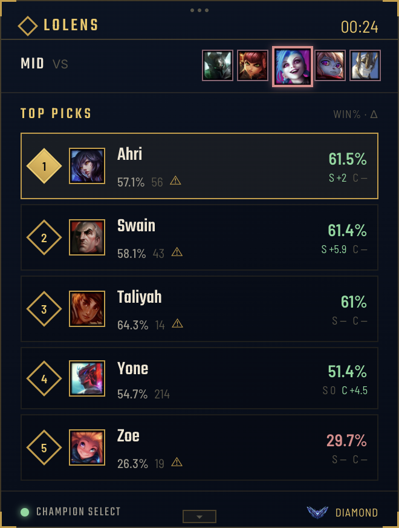

# LoLens

A real-time League of Legends draft companion. LoLens watches your live
champion select and rates your champion pool against **your own match
history** and a **rank-specific population baseline**. Not generic tier-list
advice: your actual numbers, next to real ones.



**Website:** [lolens.gg](https://www.lolens.gg) · **Downloads:** [Releases](https://github.com/DosenOff/LoLens/releases)

> **Status: alpha.** Features are still being refined, and you may run into
> bugs or incomplete functionality.

## What it does

- Runs quietly in the tray. When League launches, a small toast lets you
  know LoLens is watching.
- In champion select, a corner overlay (and the dashboard) shows picks, bans,
  and a live countdown, read straight from the League Client.
- Rates every champion in your per-role pool against the current draft:
  `Rating = Base WR + Personal Δ + Counter Δ + Synergy Δ`. Every term is
  shown, and a term only counts when there's real data behind it.
- Sample-size weighting keeps a 4-1 record from outweighing hundreds of games.
  You can tune or turn it off in Settings.
- Drag an enemy portrait into a role slot to correct who your lane opponent
  is. Counter stats update to match.

## Getting started

1. Download the installer for your OS from [lolens.gg](https://www.lolens.gg)
   or the [Releases](https://github.com/DosenOff/LoLens/releases) page.
   Available for Windows and for macOS on Apple Silicon.
2. Open LoLens and enter your Riot ID and region. No account, no API key.
3. Set your champion pools in Settings, then start a draft.

**macOS:** LoLens isn't notarized yet, so macOS blocks the first launch. After
moving it to Applications, do either of these:

- Open System Settings → Privacy & Security, scroll down, and click
  **Open Anyway**. (On macOS 14 and earlier, right-click the app and choose
  **Open** instead.)
- Or run this once in Terminal. It clears only the download-quarantine flag
  on the app:

```
xattr -dr com.apple.quarantine /Applications/LoLens.app
```

**Windows:** SmartScreen may warn because the installer isn't code-signed yet.
Click **More info → Run anyway**.

## Is it safe?

- **Read-only.** LoLens only makes `GET` requests to the League Client's local
  API to read champion select. It cannot pick, ban, click, or chat, and it
  never automates gameplay or touches game memory.
- **Verifiable releases.** GitHub shows a SHA-256 checksum next to every
  release file, so you can confirm your download matches before running it.
- **Source is viewable.** The source is published here so you can read and
  audit what the app does. It is **not** open source: see
  [Copyright](#copyright).
- **Honest about the network.** See [Your data](#your-data) for exactly what
  leaves your computer.
- **Unofficial API.** The League Client API is unofficial and not supported by
  Riot for third-party use, so it could change or break at any time.

## Your data

**Stays on your computer:** your live champion select, champion pools,
settings, Riot ID, and synced match history, all stored in local files.

**Sent to the LoLens server:** your Riot ID (name and tag) and region, when you
sync, so the server can fetch your public ranked match history from Riot's API
and return it. The server holds the Riot API key so you don't need one.
The hosting provider may keep standard request logs.

**Other requests:** champion and rank images come from Riot's Data Dragon CDN,
and fonts from Google Fonts, so those services can see your IP address.

No analytics, no ads, nothing sold or shared. Full policy on
[lolens.gg](https://www.lolens.gg) (footer).

## How it works

- **Electron** shell: tray icon, toast, corner overlay, and a small
  multi-page dashboard (home, settings, about).
- **League Client API (LCU)**: local and unofficial, for live champion select.
- **Riot Web API**: via the LoLens server, for personal match history and the
  rank-specific population baseline (built from Riot's own league and match
  endpoints: no scraping, no third-party data).

### A note on the population baseline

This isn't a Riot statistic; there isn't one. LoLens samples real players from
specific rank tiers and divisions via `league-v4`, pulls their recent ranked
matches, and counts **only that known-rank player's own result** per match.
The other nine players' ranks aren't knowable from match data, so counting
them would silently mislabel the sample. The numbers are a real but
deliberately modest sample, and sample sizes are shown next to every number so
you can judge confidence yourself.

## Development (maintainer notes)

```
npm install
cp .env.example .env   # Riot API key + Riot ID, used by the fetch scripts only
npm start
```

(Windows Command Prompt has no `cp`: use `copy .env.example .env`.)

The fetch scripts build the data the app ships with. They need a Riot API key
and are not something end users run:

```
npm run fetch-champion-data
npm run fetch-population-data     # rerun anytime to grow the sample
```

<details>
<summary>One-time asset setup (rank emblems and role icons)</summary>

Rank emblem art for the overlay's tier badge. macOS/Linux:

```
curl -fL https://static.developer.riotgames.com/docs/lol/ranked-emblems-latest.zip -o ranked-emblems.zip
mkdir -p assets/rank-emblems
unzip ranked-emblems.zip -d assets/rank-emblems
cd "assets/rank-emblems/Ranked Emblems Latest"
for f in Rank=*.png; do
  name=$(echo "$f" | sed -E 's/Rank=(.*)\.png/\1/' | tr '[:upper:]' '[:lower:]')
  mv "$f" "../${name}.png"
done
cd ..
rm -rf "Ranked Emblems Latest" "Tier Wings" "Wings"
```

Windows (PowerShell):

```
Invoke-WebRequest https://static.developer.riotgames.com/docs/lol/ranked-emblems-latest.zip -OutFile ranked-emblems.zip
New-Item -ItemType Directory -Force assets\rank-emblems | Out-Null
Expand-Archive ranked-emblems.zip assets\rank-emblems
Set-Location "assets\rank-emblems\Ranked Emblems Latest"
Get-ChildItem "Rank=*.png" | ForEach-Object {
  $name = ($_.BaseName -replace '^Rank=', '').ToLower()
  Move-Item $_.FullName "..\$name.png"
}
Set-Location ..
Remove-Item -Recurse -Force "Ranked Emblems Latest", "Tier Wings", "Wings"
```

Role icons shown while dragging an enemy portrait. macOS/Linux:

```
mkdir -p assets/role-icons
BASE="https://raw.communitydragon.org/latest/plugins/rcp-fe-lol-clash/global/default/assets/images/position-selector/positions"
for role in top jungle middle bottom utility; do
  curl -fL "$BASE/icon-position-$role.png" -o "assets/role-icons/$role.png"
done
```

Windows (PowerShell):

```
New-Item -ItemType Directory -Force assets\role-icons | Out-Null
$base = "https://raw.communitydragon.org/latest/plugins/rcp-fe-lol-clash/global/default/assets/images/position-selector/positions"
foreach ($role in "top","jungle","middle","bottom","utility") {
  Invoke-WebRequest "$base/icon-position-$role.png" -OutFile "assets\role-icons\$role.png"
}
```

Without these, the UI degrades gracefully (a plain gold diamond, and text
labels instead of icons).

</details>

## Copyright

Copyright © 2026 Shawn Lee. **All rights reserved.**

The source code in this repository is published for transparency only. No
license is granted to copy, modify, redistribute, sublicense, or build
derivative works from it. You may download and use the official LoLens
releases for personal use under the terms on [lolens.gg](https://www.lolens.gg).

## Legal

LoLens is not endorsed by Riot Games and does not reflect the views or
opinions of Riot Games or anyone officially involved in producing or managing
League of Legends. League of Legends and Riot Games are trademarks or
registered trademarks of Riot Games, Inc.

The League Client API used here is unofficial and not supported by Riot for
third-party use.